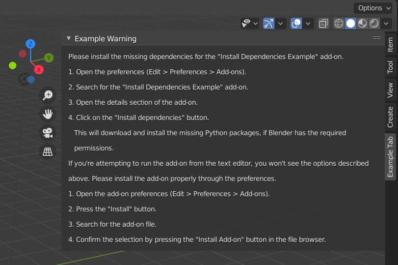
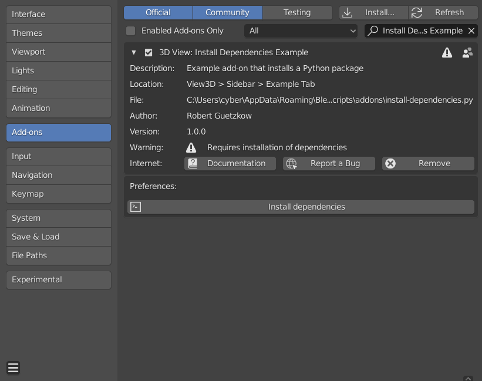

# Install dependencies

## Description

This add-on demonstrates how to install Python packages from within Blender. Elevated privileges may be required, depending on the permissions set on Blender's directory.

## Implementation

### Dependencies

The required dependencies are declared at the beginning the form a tuple of `namedtuple` and the installation state of the dependencies is stored as boolean in 
[`dependencies_installed`](https://github.com/robertguetzkow/blender-python-examples/blob/cd3597939d77e37bb45434533440d56262f01a55/add-ons/install-dependencies/install-dependencies.py#L41).

### Registration

The [registration](https://github.com/robertguetzkow/blender-python-examples/blob/cd3597939d77e37bb45434533440d56262f01a55/add-ons/install-dependencies/install-dependencies.py#L222) is split into three steps:

1. Register the classes related to the add-on's preferences and a panel with installation instructions.
2. Check if the required dependencies are installed and try to import them. Only proceed to 3.) if the modules can be found and set `dependencies_installed` to true.
3. Register all other classes, e.g. panels, operators, etc.

The user will see a panel with installation instructions ([`EXAMPLE_PT_warning_panel`](https://github.com/robertguetzkow/blender-python-examples/blob/cd3597939d77e37bb45434533440d56262f01a55/add-ons/install-dependencies/install-dependencies.py#L144)) 
in place of the actual operators should step 2.) fail. In case it is successful, `EXAMPLE_PT_warning_panel` won't be displayed. This is because the 
[`poll`](https://github.com/robertguetzkow/blender-python-examples/blob/cd3597939d77e37bb45434533440d56262f01a55/add-ons/install-dependencies/install-dependencies.py#L151) method checks `dependencies_installed`.

### Add-on's preferences

The add-on's preferences are implemented by [`EXAMPLE_preferences`](https://github.com/robertguetzkow/blender-python-examples/blob/cd3597939d77e37bb45434533440d56262f01a55/add-ons/install-dependencies/install-dependencies.py#L209), which display the 
operator [`EXAMPLE_OT_install_dependencies`](https://github.com/robertguetzkow/blender-python-examples/blob/cd3597939d77e37bb45434533440d56262f01a55/add-ons/install-dependencies/install-dependencies.py#L175). This creates a button in the details section 
of the add-on's preferences that allows the user to install the required Python packages. It calls the 
[`install_pip`](https://github.com/robertguetzkow/blender-python-examples/blob/cd3597939d77e37bb45434533440d56262f01a55/add-ons/install-dependencies/install-dependencies.py#L63) function to install pip and
[`install_and_import_module()`](https://github.com/robertguetzkow/blender-python-examples/blob/cd3597939d77e37bb45434533440d56262f01a55/add-ons/install-dependencies/install-dependencies.py#L85) function to install and import the dependencies. If this step is 
successful the `dependencies_installed` is set to true and the remaining panels, operators, etc. are registered as well.

The design that requires the user to manually press a button in the preferences, instead of automatically installing the packages, is intentional. The user should give explicit consent when files are
downloaded from the internet and Python packages are installed on their system. [The Blender Foundation takes their user's privacy and security serious](https://www.blender.org/about/license/), as an 
add-on developer you should as well.

### Preparing pip

The installation of packages requires pip. Only the Windows release of Blender 2.81 includes pip, therefore it is necessary to install it through [`ensurepip.bootstrap()`](https://docs.python.org/3/library/ensurepip.html#ensurepip.bootstrap) which is done in 
[`install_pip`](https://github.com/robertguetzkow/blender-python-examples/blob/cd3597939d77e37bb45434533440d56262f01a55/add-ons/install-dependencies/install-dependencies.py#L63). `ensurepip.bootstrap()` 
[calls pip](https://github.com/python/cpython/blob/34b0598295284e3ff6cedf5c05e159ce1fa54d60/Lib/ensurepip/__init__.py#L35). During its execution pip sets the environment variable 
[`PIP_REQ_TRACKER`](https://github.com/pypa/pip/blob/326efa5c710ecf19acc3e1315477251a4cd4bd13/src/pip/_internal/req/req_tracker.py#L54) which is used as a temporary directory. Unfortunately pip doesn't remove the environment variable and subsequent calls to pip 
will attempt to use the path in `PIP_REQ_TRACKER` as temporary directory. However, this directory doesn't exist anymore and the pip would throw an exception. Therefore, `os.environ.pop("PIP_REQ_TRACKER", None)` is needed.

### Installing the package

The package installation is accomplished by [calling pip through `subprocess`](https://github.com/robertguetzkow/blender-python-examples/blob/cd3597939d77e37bb45434533440d56262f01a55/add-ons/install-dependencies/install-dependencies.py#L105). The path to the 
Python binary is given by [`bpy.app.binary_path_python`](https://docs.blender.org/api/current/bpy.app.html#bpy.app.binary_path_python).

### Importing the module

The programmatic import is done through [`importlib.import_module()`](https://docs.python.org/3/library/importlib.html#importlib.import_module) and the result is assigned to the global symbol table dictionary 
returned by [`globals()`](https://docs.python.org/3/library/functions.html#globals).

## The user's perspective

The user installs the add-on through the user preferences (*Edit > Preferences > Add-ons*). They might check the sidebar where they expect to find the add-on's operators, but find the panel with the installation instructions instead.
Hence they go back to the preferences, open the details section of the add-on and press the button to install the dependencies. Once the install is completed the tab in the sidebar shows all operators as expected.

Failures during installation are reported to the user in a popup. In case the add-on is executed as a script, instead of being installed as add-on, it will display the installation instructions in the sidebar as well.

## Improvement suggestions for your own add-on

- Show a more descriptive error message when a "permission denied" error occurs during the installation of packages. Inform the user that elevated permission are necessary and provide instructions to resolve the issue. Ideally Blender shouldn't be started with
 elevated permissions, since this would be against security best practice. Therefore, you could provide instructions to install the packages manually and include a `requirements.txt`.

## Additional Information

The add-on was originally developed as an answer to the [this question](https://blender.stackexchange.com/questions/168448/bundling-python-library-with-addon) on Blender's StackExchange.

## Change log

### 1.0.2 - 2020-05-20

 **Compatible Blender versions:** 2.81 to 2.90

 **Commit hash:** [cd3597939d77e37bb45434533440d56262f01a55](https://github.com/robertguetzkow/blender-python-examples/commit/cd3597939d77e37bb45434533440d56262f01a55)

 **Changes:**
 - Fix `install_pip` for when the ensurepip modules is not available but pip is already installed

### 1.0.1 - 2020-05-19

 **Compatible Blender versions:** 2.81 to 2.90

 **Commit hash:** [211e51a3ac2a83f4f1db5a80c59eded138acbf40](https://github.com/robertguetzkow/blender-python-examples/commit/211e51a3ac2a83f4f1db5a80c59eded138acbf40)

 **Changes:**
 - Refactor `install_and_import_module()` and place installation of pip in a separate function `install_pip`

### 1.0.0 - 2020-05-18

 **Compatible Blender versions:** 2.81 to 2.90

 **Commit hash:** [226ef43cf003511b6220e7135d4b6a8289729582](https://github.com/robertguetzkow/blender-python-examples/commit/226ef43cf003511b6220e7135d4b6a8289729582)

 **Changes:**
 - Initial version
